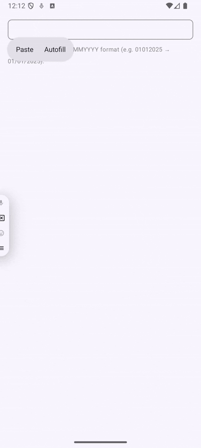

# 📅 Jetpack Compose Date Input Formatter

A sample Android app showing how to use **OutputTransformation** and **InputTransformation** in Jetpack Compose to build a clean **date input field** with realtime formatting.

## ✨ Features
- Progressive **DD/MM/YYYY** formatting as user types  
- **Input limit** (max 8 digits)  
- Styled separators (`/`) for better readability  
- Inline **disclaimer** guiding the user to input date in `DDMMYYYY` format  

## 🎥 Demo

## 🛠️ Tech Stack
- [Jetpack Compose](https://developer.android.com/jetpack/compose)  
- `BasicTextField` with **OutputTransformation** + **InputTransformation**  
- Kotlin  
